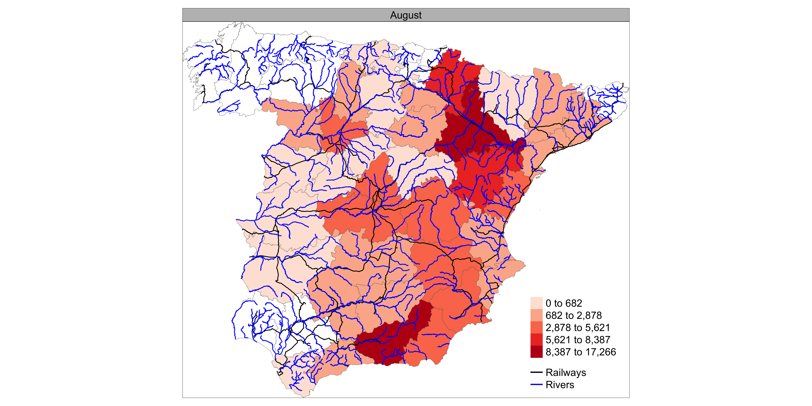
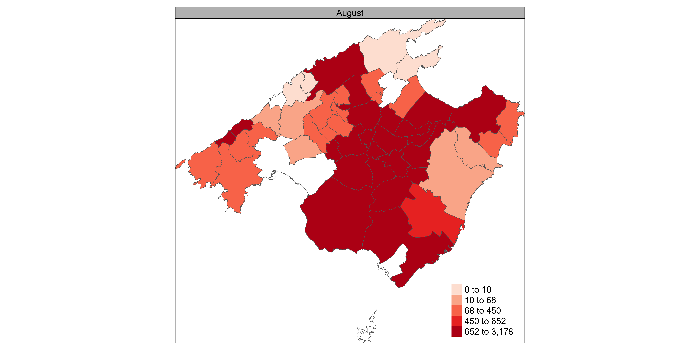

# EPI-PREDICT

This repository contains models of the expansion of the black death and cholera outbreaks in Spain throughout the 19th century.

## Overview

This project focuses on analyzing historical data related to the black death and cholera outbreaks in Spain during the 19th century. Various models are implemented to predict the expansion of these outbreaks affected by transport infrastructures and watercourses, providing insights into the dynamics of infectious diseases and their spread.

## Repository Contents

- **webapp**: Directory containing the web application code for visualizing cholera outbreak data. You can access the public version of the web application [here](https://epipredict-project.shinyapps.io/webapp/).
- **colera_data.R**: R script for processing cholera outbreak data.
- **colera_inla.dist.R**: R script for modelling the risk of cholera outbreak expansion using [R-INLA](https://www.r-inla.org/).
- **colera_stp.R**: R script for analyzing spatial and temporal patterns of cholera outbreak data using `local Moran's I` and `Getis-Ord Gi*` approaches.
- **covariates.R**: R script for processing covariates data.
- **peste_data.R**: R script for processing black death outbreak data.
- **peste_inla.dist.R**: R script for modelling the risk of black death outbreak expansion using R-INLA.
- **peste_inla.pred.R**: R script for predicting new locations of black death outbreak expansion using R-INLA.

## Usage

To use this project, follow these steps:

1. Clone the repository, install the required dependencies and configure the project as described in the [INSTALL.md](INSTALL.md) file.
2. Run the various R scripts to process data, build models and analyze results (see Running the Project section below).
3. Optionally, deploy the web application to visualize the cholera outbreak data (see the webapp directory for more details).

### Running the Project

To run the project, you need to execute the data preprocessing scripts first. These scripts include:

```bash
Rscript colera_data.R # internally executes covariates.R
Rscript peste_data.R 
```

Once the data preprocessing is complete, you can execute the modelling and analysis scripts independently as they do not depend on each other to perform modelling and analysis tasks. These scripts include:

```bash
Rscript colera_inla.dist.R # Process risk of cholera outbreak expansion
Rscript colera_stp.R # Analyze spatial and temporal patterns of cholera outbreak
Rscript peste_inla.dist.R # Process risk of black death outbreak expansion
Rscript peste_inla.pred.R # Predict new locations of black death outbreak expansion
```

The scripts are designed to be run from the root directory of the project but you use RStudio. If you're using RStudio, you can also execute the scripts by opening them in RStudio and clicking the "Source" button.

| Observed cases by provinces | Observed cases by municipalities |
|----------|----------|
|  |  |

## References

Codes in this repository have been adapted from the following useful guides:

- Paula Moraga (2019), [Geospatial Health Data: Modeling and Visualization with R-INLA and Shiny](https://www.paulamoraga.com/book-geospatial/index.html).
- Rajiv Xavier (2020), [Detecting Spatiotemporal Patterns of COVID-19 in Central Mexico](https://rpubs.com/rax/Take_Home_Ex02).

## Support

For any questions, issues, or feedback regarding this project, please open an issue in this repository or contact us via email at [lrodrin@gmail.com](mailto:lrodrin@gmail.com) or [jpujadasmo@uoc.edu](mailto:jpujadasmo@uoc.edu).

## License

© 2023-2024 Universitat Oberta de Catalunya (UOC), ES. All rights reserved.

Licensed under the MIT License. See the [LICENSE](LICENSE) file for more information.
